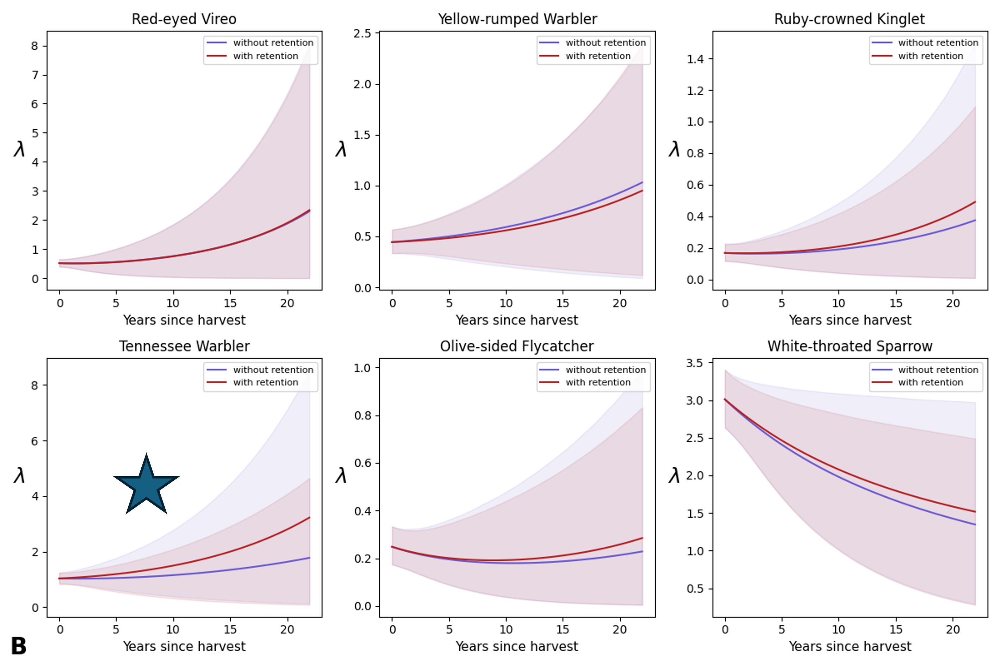

# Isabelle's portfolio

<table>
  <tr>
    <td>
      
    </td>
    <td style="vertical-align: top; text-align: left;">
      Quantitative ecologist: avian population and density change in a complex boreal forest system
    </td>
  </tr>
</table>

## Distance-based perceptibility truncation

How do you make sure the area we acoustically sample is even across our sites in the boreal forest?

Develop a novel method to standardize acoustic sampling radius!
1. Get acoustic characteristics of species
2. Formalise [relationship](https://github.com/IsabelleLebTay/IsabelleLebTay.github.io/blob/main/1.%20Scripts/python/edr_curves_theory.ipynb) between [sound, distance, forest, and frequency](https://github.com/IsabelleLebTay/IsabelleLebTay.github.io/blob/main/1.%20Scripts/R/attenuation_selected_model.R)

3. Identify target distance at which to stop counting birds. Keep constant over all sites
4. Predict volume of bird songs according to site conditions at target distance
5. [Truncate](https://github.com/IsabelleLebTay/IsabelleLebTay.github.io/blob/main/1.%20Scripts/python/distance_truncation.ipynb) acoustic detections to exclude birds singing too far away.

**Bird abundance in regenerating logged forests with and without retnetion**

*A: before truncation*                       *B: after truncation* 

  
  

## Mapping field photos hosted on external website to locations
We collect photos in the field using [Epicollect5](https://five.epicollect.net), a data collection tool. To download photos, I wrote a script to use their API for [batch downloads](https://github.com/IsabelleLebTay/IsabelleLebTay.github.io/blob/main/1.%20Scripts/python/Epicollect_media_request.py), and adjusted image metadata.

## I like to write stats models sometimes
I often find I want to something a little out of the box for my data analysis. Sometimes premade R and Python stats packages work, and sometimes they don't. For that reason, I love using Bayesian methods, since its flexibility allows you to write out exactly what you want.

For example, I build, test, and run single-species abundance and N-mixtures models in Stan:
[single species models](https://github.com/IsabelleLebTay/AbundanceConditionalOccupancy)

I am also using JAGS, as its strong tradition in ecology makes it useful for collaboration:
[multi-species spatial occupancy](https://github.com/IsabelleLebTay/Retention-Community/blob/main/1_Script/community/occupancy_limited_percept.Rmd)

## GIS: where can old growth bird specialists go?
In Alberta, the boreal forest is logged in patches, and has been for the last century. Old growth specialists, like the Black-throated Green Warbler, are listed in this provice and need large tracts of relatively undisturbed old forests (Hart et al., 2024). So how many of these patches are there?

From over 20,000 breeding bird monitoring sites, around *500* were potential candidates for [interior forest specialists](https://github.com/IsabelleLebTay/Forest-interior-community/blob/main/1.%20Scripts/Python/explore%20locations.ipynb)

