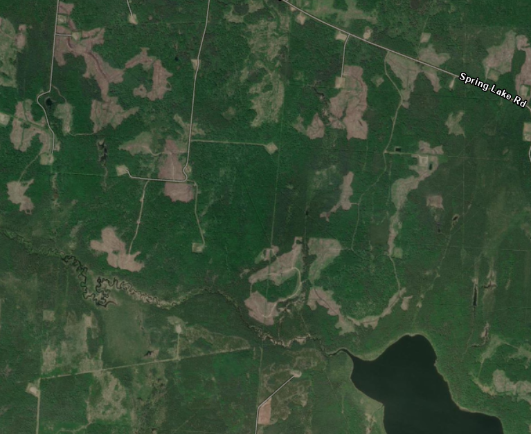

# Isabelle's portfolio 

Quantitative ecologist, avian population and density change in a complex boreal forest system.

# Projects
## Distance-based perceptibility truncation

How do you make sure the area we acoustically sample is even across our sites in the boreal forest?

Develop a novel method to standardize acoustic sampling radius!
1. Get acoustic characteristics of species
2. Formalise [relationship]() between sound, distance, forest, and frequency
3. Identify target distance at which to stop counting birds. Keep constant over all sites
4. Predict volume of bird songs according to site conditions at target distance
5. Truncate acoustic detections to exclude birds singing too far away.

**Bird abundance in regenerating logged forests with and without retnetion**
*A: before truncation                                          B: after truncation*

  
  

## Mapping field photos hosted on external website to locations
We collect photos in the field using [Epicollect5](https://five.epicollect.net), a data collection tool. To download photos, I wrote a script to access their API, and adjusted image metdata.

[Epicollect media download](https://github.com/IsabelleLebTay/IsabelleLebTay.github.io/blob/main/1.%20Scripts/python/Epicollect_media_request.py)

## I like to write my own stats models sometimes
I often find I want to something a little out of the box for my data analysis. Sometimes premade R stats packages work, and sometimes they don't. For that reason, I love using Bayesian methods, since it's flexibility allows you to write out exactly what you want.

For example, I built, tested, and ran single-species abundance and N-mixtures models in Stan:
[Stan: single species](https://github.com/IsabelleLebTay/AbundanceConditionalOccupancy)

I am also using JAGS, as there is a strong JAGS tradition in ecology and it is easier to collaborate with others:
[Multi-species spatial occupancy](https://github.com/IsabelleLebTay/Retention-Community/blob/main/1_Script/community/occupancy_limited_percept.Rmd)

## GIS: where can old growth bird specialists go?
In Alberta, the boreal forest is logged in patches, and has been for the last century. Old growth specialists, like the Black-throated Green Warbler, are listed in this provice and need large tracts of relatively undisturbed old forests (Hart et al., 2024). So how man yof these patches are there?

Spatial analysis: identifying historical sampling locations that are possible old forest specialist habitat

From over 20,000 breeding bird monitoring sites, around *500* were potential candidates for interior forest specialists
[Forest interior community](https://github.com/IsabelleLebTay/Forest-interior-community/blob/main/1.%20Scripts/Python/explore%20locations.ipynb)

