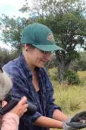
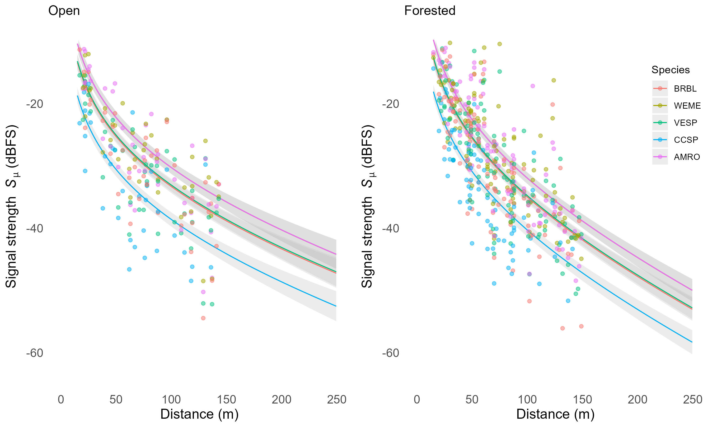
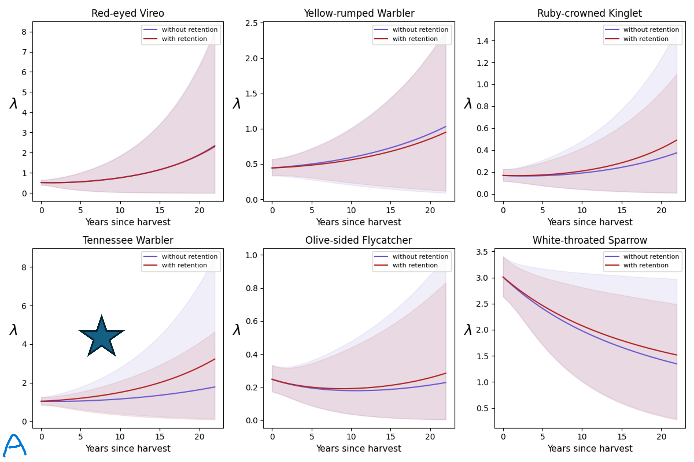
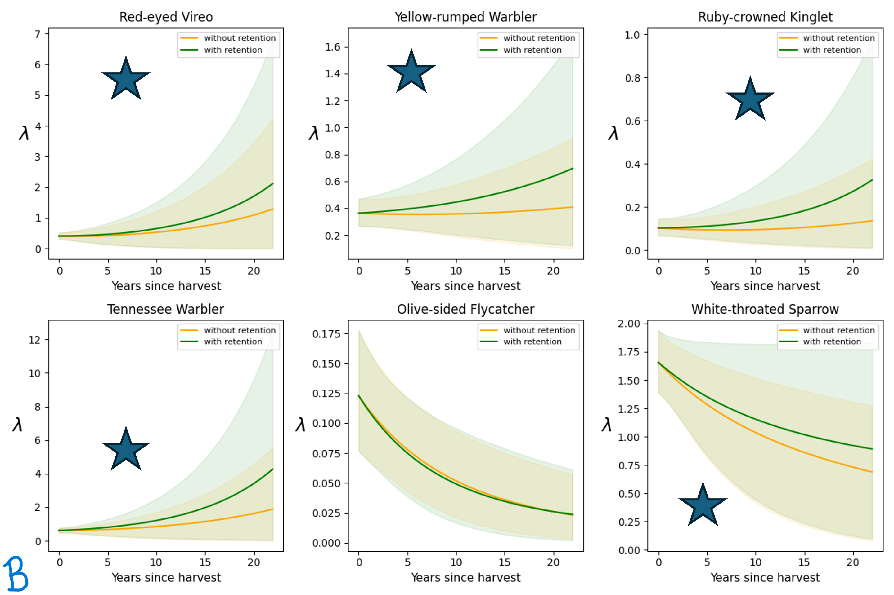

# Projects

<table>
  <tr>
    <td>
      
    </td>
    <td style="vertical-align: top; text-align: left;">
      Quantitative ecologist: avian population and density change in a complex boreal forest system. I like birds, stats, and coding.
    </td>
  </tr>
</table>

## Table of Contents
- [Improving bird count in acoustic surveys](#Distance-based-perceptibility-truncation)
- [Batch downloading with Epicollect5 API](#Batch-download-and-make-sense-of-field-photos)
- [Stats: Bayes](#Bayesian-models-are-useful)
- [GIS: where do the birds go](#GIS_example:-where-can-old-growth-forest-birds-go?)

## Distance-based perceptibility truncation

How do we make sure the area we acoustically sample is even across study sites in the boreal forest?

Develop a novel method to standardize acoustic sampling radius!
1. Get acoustic characteristics of species
2. Formalise [relationship](https://github.com/IsabelleLebTay/IsabelleLebTay.github.io/blob/main/1.%20Scripts/python/edr_curves_theory.ipynb) between [sound, distance, forest, and frequency](https://github.com/IsabelleLebTay/IsabelleLebTay.github.io/blob/main/1.%20Scripts/R/attenuation_selected_model.R)

3. Identify target distance at which to stop counting birds. Keep constant over all sites
4. Predict volume of bird songs according to site conditions at target distance
5. [Truncate](https://github.com/IsabelleLebTay/IsabelleLebTay.github.io/blob/main/1.%20Scripts/python/distance_truncation.ipynb) acoustic detections to exclude birds singing too far away.

**Case study:** Bird abundance in regenerating logged forests with and without retention

No evidence of response *before* truncation, whereas actual response is revealed using the method I developed.

*A: before truncation* &nbsp;&nbsp;&nbsp;&nbsp;&nbsp;&nbsp;&nbsp;&nbsp;&nbsp;&nbsp;&nbsp;&nbsp;&nbsp;&nbsp;&nbsp;&nbsp;&nbsp;&nbsp;&nbsp;&nbsp;&nbsp;&nbsp;&nbsp;&nbsp;&nbsp;&nbsp;&nbsp;&nbsp;&nbsp;&nbsp;&nbsp;&nbsp;&nbsp;&nbsp;&nbsp;&nbsp;&nbsp;&nbsp;&nbsp;&nbsp;&nbsp;&nbsp;&nbsp;&nbsp;&nbsp;&nbsp;&nbsp;&nbsp;&nbsp;&nbsp;&nbsp;&nbsp;&nbsp;&nbsp;&nbsp;&nbsp;&nbsp;&nbsp;&nbsp;&nbsp;&nbsp;&nbsp;&nbsp;&nbsp;&nbsp;&nbsp;&nbsp;&nbsp;&nbsp;&nbsp;&nbsp;&nbsp;&nbsp;&nbsp;&nbsp;&nbsp;*B: after truncation*

  
  

## Batch download and make sense of field photos
We collect photos in the field using [Epicollect5](https://five.epicollect.net), a data collection tool. I wrote a script to use their API for [batch downloads](https://github.com/IsabelleLebTay/IsabelleLebTay.github.io/blob/main/1.%20Scripts/python/Epicollect_media_request.py).

## Bayesian models are useful
I often find I want to use models that are out of the box. Premade R and Python stats packages don't always satistfy the mathematical complexity of spatial systems. For that reason, I love using Bayesian methods, since its flexibility allows you to write out exactly what you want.

For example, I build, test, and run single-species abundance and N-mixtures models in Stan:
[single species models](https://github.com/IsabelleLebTay/AbundanceConditionalOccupancy)

I also use JAGS, as its strong tradition in ecology makes it useful for collaboration:
[multi-species spatial occupancy](https://github.com/IsabelleLebTay/Retention-Community/blob/main/1_Script/community/occupancy_limited_percept.Rmd)

## GIS example: where can old growth forest birds go?
In Alberta, the boreal forest is logged in patches, and has been for over a century. Old growth specialists, like the Black-throated Green Warbler, are listed in this provice and need large tracts of relatively undisturbed old forests, and will avoid forest edges. How does that edge avoidance shape habitat use in dynamic forest conditions?

For example, from over 20,000 breeding bird monitoring sites in boreal Alberta, around *500* are potential candidates for [interior forest specialists](https://github.com/IsabelleLebTay/Forest-interior-community/blob/main/1.%20Scripts/Python/explore%20locations.ipynb)

